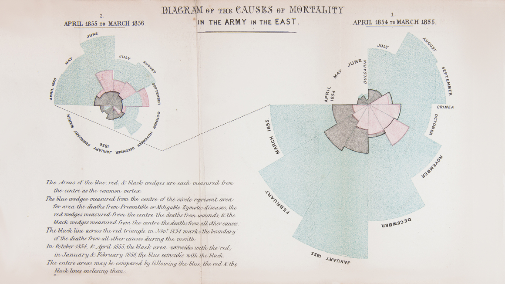

---
authors:
- admin
categories: []
date: "2021-03-08T01:00:00Z"
draft: false
featured: false
image:
  caption: ""
  focal_point: ""
lastMod: "2021-03-08T01:00:00Z"
projects: []
subtitle: 
summary: 
tags: 
- RETINA
title: 'Learn more about our logo'
---

The [RETINA project](https://retinalab.netlify.app/post/acronym/) focuses on four different areas: [Anomaly Detection](https://en.wikipedia.org/wiki/Anomaly_detection), [Data Science](https://en.wikipedia.org/wiki/Data_science), [Open Science](https://en.wikipedia.org/wiki/Open_science) and [Women in STEM fields](https://en.wikipedia.org/wiki/Women_in_STEM_fields). The RETINA logo is a symbolic representation of these key focuses of the RETINA project.

1. The retina is a layer of nerve cells located on the back inside wall of our eyeball which helps us to convert light into signals that our brain can interpret. Several parts of the eye are associated with the retina.  Under RETINA project, collaborative research is another way in which we have chosen to pursue key mathematical challenges in anomaly detection. The RETINA project logo represents the retina inside an eye.

2. The central part of the logo contains [Florence Nightingale’s](https://en.wikipedia.org/wiki/Florence_Nightingale) "Rose" diagram. Data Visualization is one of the major pillars of Data Science and Florence Nightingale is a pioneer in the visual presentation of information and statistical graphics. She is a statistician and the founder of modern nursing and Rose plot is one of her unique contributions to data visualization. The RETINA logo recognizes the achievements and contributions of all the women in STEM fields.

*Florence Nightingale. Diagram of the Causes of Mortality in the Army of the East, 1858. Image source: https://www.maharam.com/stories/sherlock_florence-nightingales-rose-diagram*

3. Anomaly detection is an important research area of data mining and it is one of the key focuses of the RETINA project. The rose plot in the logo also contains an anomaly to symbolizes its main focus.

[Learn more about our acronym: RETINA, here](https://retinalab.netlify.app/post/acronym/)

 