```{r setup, include=FALSE}
library(knitr)
options(htmltools.dir.version = FALSE)
opts_chunk$set(
  warning = FALSE,
  message = FALSE,
  echo = FALSE,
  cache.path = 'cache/',
  fig.align = 'center',
  cache = FALSE
)
library(anicon)

```
```{r xaringan-themer, include=FALSE, warning=FALSE}
library(xaringanthemer)
style_mono_accent(
   base_color = "#002c54",
   title_slide_background_color = "#031642",
  inverse_background_color = "#031642",
  header_font_google = google_font("Josefin Sans"),
  #text_font_google   = google_font("Montserrat", "300", "300i"),
  code_font_google   = google_font("Fira Mono"),
  title_slide_text_color = "#e3d53d",
  inverse_header_color = "#ffea00",
   header_background_text_color = "#ffea00",
   text_font_size = "1.4rem",
   text_font_url = "#ffea00",
    text_bold_font_weight = "bold",
  header_font_url = "#ffea00",
  inverse_link_color = "#d70dde",
  text_font_base = "sans-serif",
   text_font_weight = xaringanthemer_font_default("text_font_weight")
  )
```


class: inverse, center

## Motivation: Forest Coverage of Rondônia, Brazil 

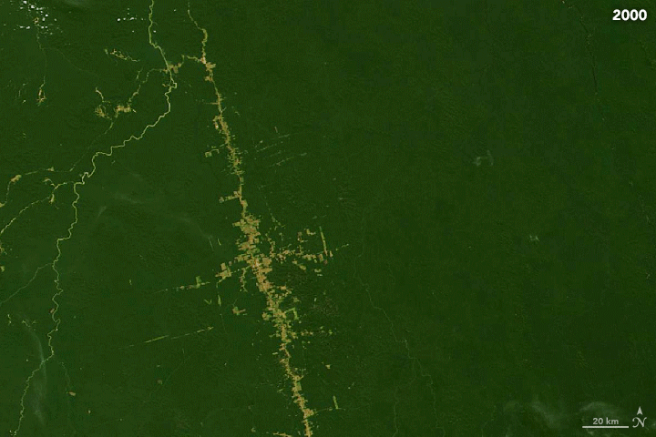


Allows to identify deforested areas and assess the rate of forest lost

---

class: inverse, middle, center

## Motivation: Undersea Volcano Eruption near Tonga


Allows us to track the eruption plumes and identify areas at risk

<!--

class: inverse, middle, center

<!-- https://www.sciencealert.com/stunning-images-from-space-reveal-the-extent-of-australia-s-bushfire-crisis-->
<!--## Motivation: Australia's Bushfire in 2020


 Monitoring and assessing the spread and intensity of bushfire-->
---

class: inverse,  center


.pull-left[

### Forest Coverage of Rondônia, Brazil 


].pull-right[

### Undersea Volcano Eruption near Tonga


]

--

 Exhibit a distinct typical behaviour that remains relatively static over a large period at the initial phase and then they display usual behaviour that deviates from the usual static patterns.

---


class: inverse, center, middle

## What is an anomaly ?

- By definition, anomalies are rare in comparison to a system's typical behaviour.

--

- We define an anomaly as an observation that is very unlikely given the forecast distribution.

---

### Aim 

- To develop a novel framework that detects and interprets anomalies in image streams using computer vision, time series forecasting, extreme value theory, and explainable AI.

--

### Main Assumptions

- Anomalies show a significant deviation from the typical behavior of a given system.

--

- A representative dataset of the system’s typical behavior is available to define a model for the typical behavior of the image streams generated by a given system.


---

### Proposed Algorithm

- **Off-line Phase**: Forecast a data driven anomalous threshold for system's typical behavior 

--

- **On-line Phases**: Testing newly arrived data using the forecasted anomalous threshold

---
### Off-line Phase

```{r   out.width = "90%", echo = FALSE, fig.cap='', fig.align='center'}
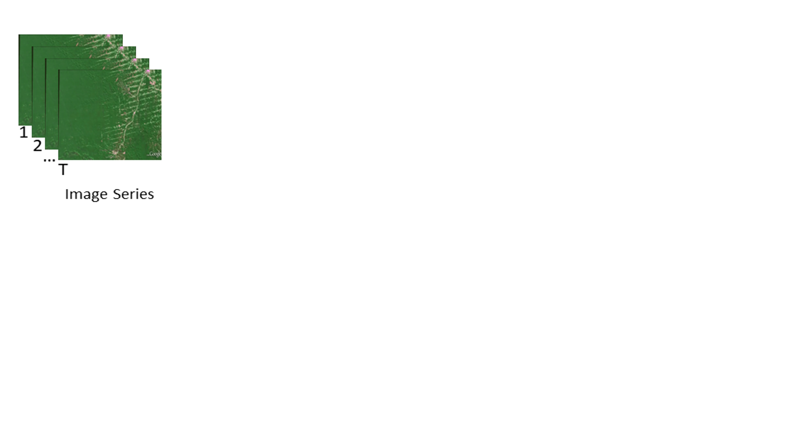
```

---

### Off-line Phase

```{r   out.width = "90%", echo = FALSE, fig.cap='', fig.align='center'}
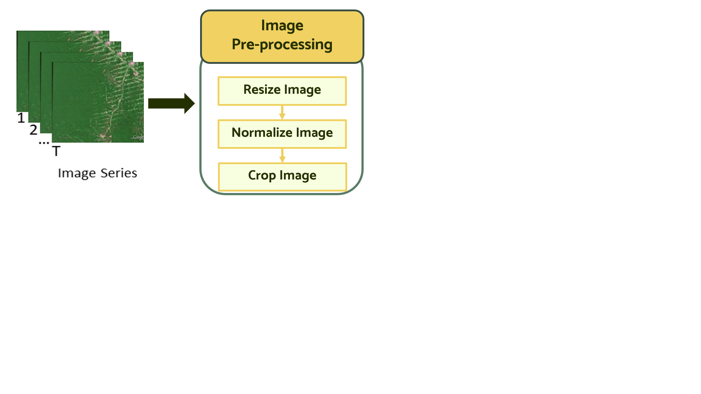
```

---

### Off-line Phase
```{r   out.width = "90%", echo = FALSE, fig.cap='', fig.align='center'}
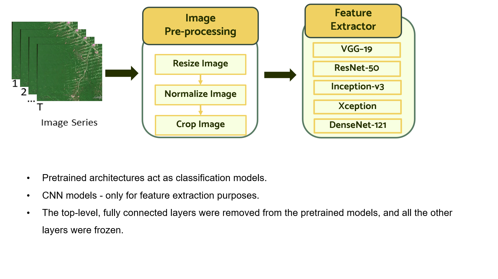
```

- Improve the efficiency and performance of the subsequent steps
---

### Off-line Phase
```{r   out.width = "90%", echo = FALSE, fig.cap='', fig.align='center'}
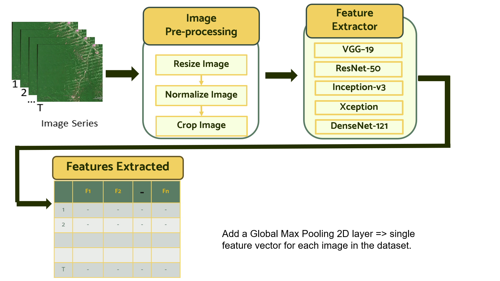
```


---

### Off-line Phase
```{r   out.width = "90%", echo = FALSE, fig.cap='', fig.align='center'}
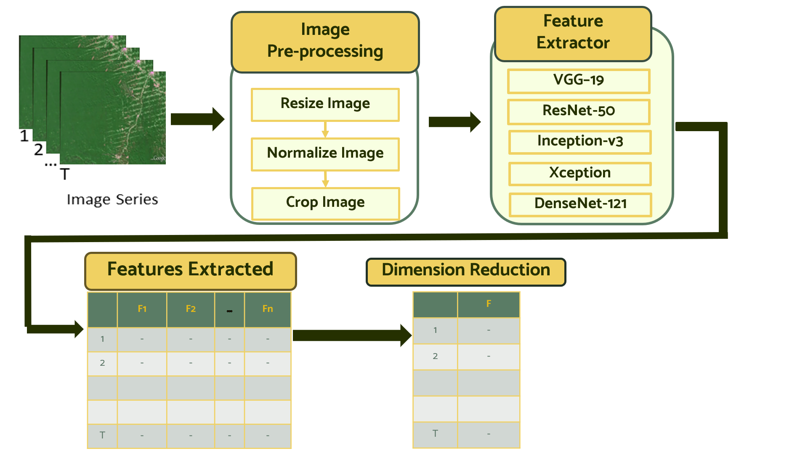
```

---


### Off-line Phase
```{r   out.width = "90%", echo = FALSE, fig.cap='', fig.align='center'}
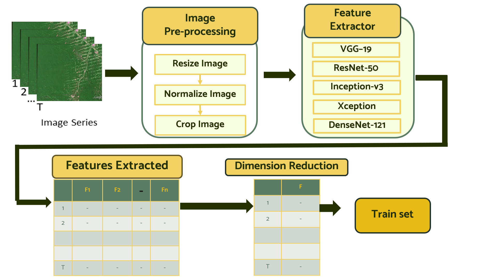
```

---


### Off-line Phase - Anomalous threshold calculation
```{r   out.width = "90%", echo = FALSE, fig.cap='', fig.align='center'}
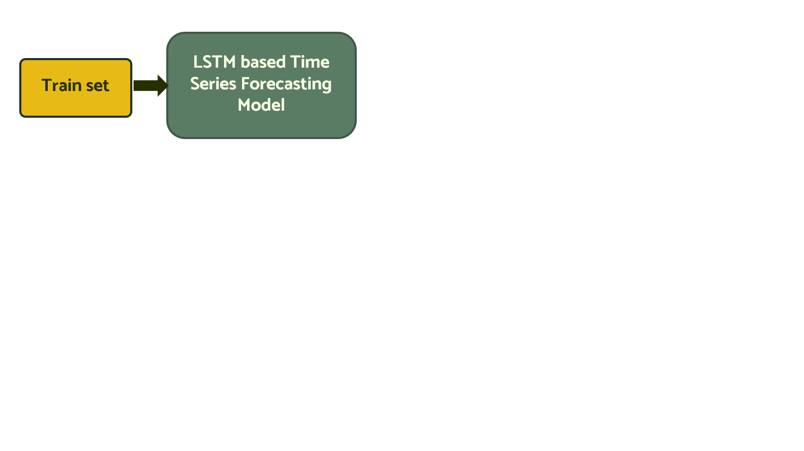
```

---


### Off-line Phase - Anomalous threshold calculation
```{r   out.width = "90%", echo = FALSE, fig.cap='', fig.align='center'}
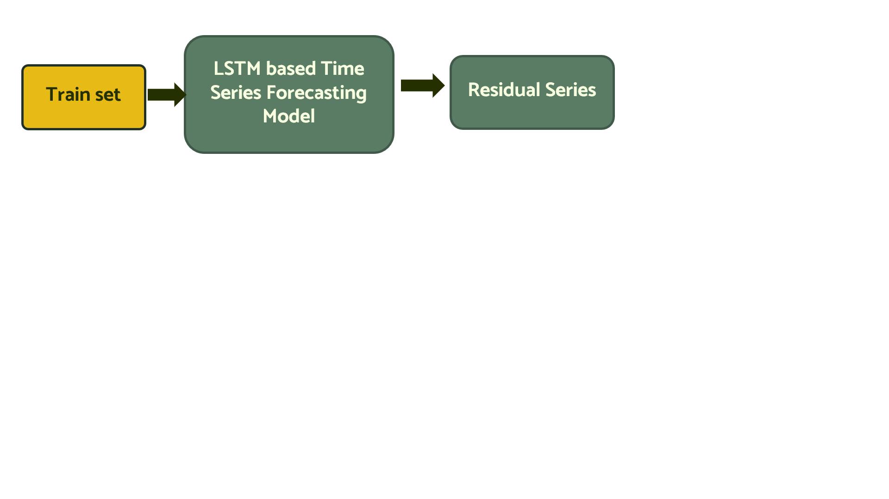
```

---


### Off-line Phase - Anomalous threshold calculation
```{r   out.width = "90%", echo = FALSE, fig.cap='', fig.align='center'}
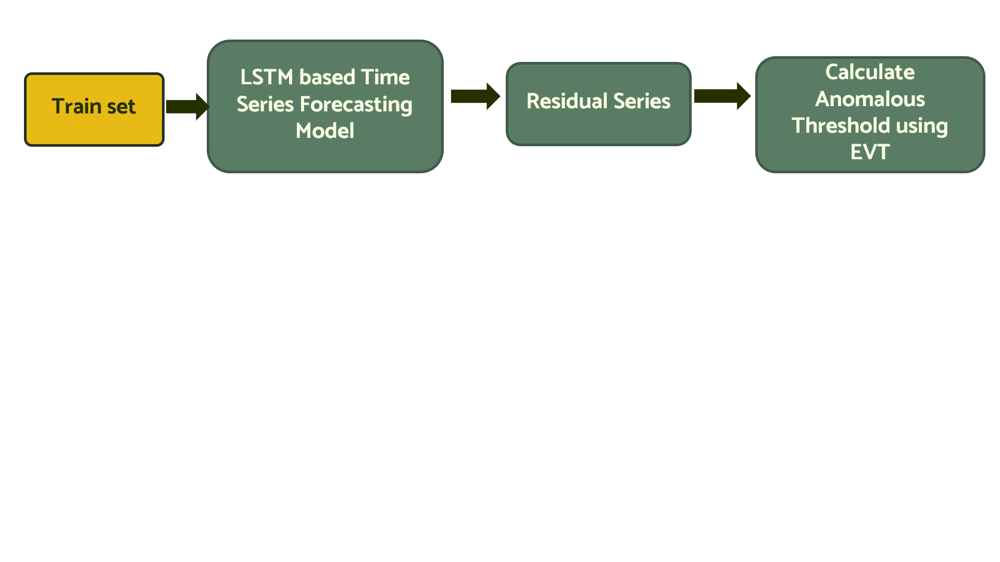
```
---


.pull-left[

#### Anomalous threshold calculation
##### Spacing theorem (Weissman, 1978)

- Let $X_{1}, X_{2}, ..., X_{T}$ be a sample from a distribution function $F$.

- Let $X_{1:T} \geq X_{2:T} \geq ... \geq X_{T:T}$ be the order statistics.

- The available data are $X_{1:T}, X_{2:T},  ..., X_{k:T}$ for some fixed $k$.

- Let $D_{i,T} = X_{i:T} - X_{i+1:T},$ $(i = 1,2,..., k)$ be the spacing between successive order statistics.


].pull-right[

- If $F$ is in the maximum domain of attraction of the Gumbel distribution, then the spacing $D_{i,n}$ are asymptotically independent and exponentially distributed with mean proportional to $i^{-1}$.

```{r  echo=FALSE, out.width = "100%", fig_align = 'top'}
knitr::include_graphics("fig/19_EVT.png")
```

]
---

### On-line Phase
```{r   out.width = "90%", echo = FALSE, fig.cap='', fig.align='center'}
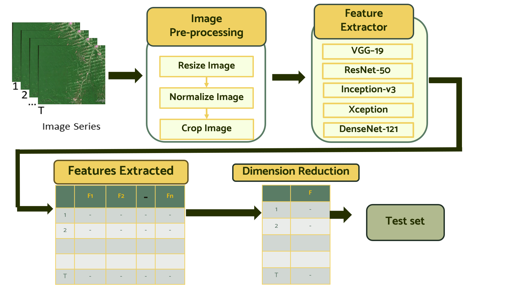
```

---


### On-line Phase
```{r   out.width = "100%", echo = FALSE, fig.cap='', fig.align='center'}
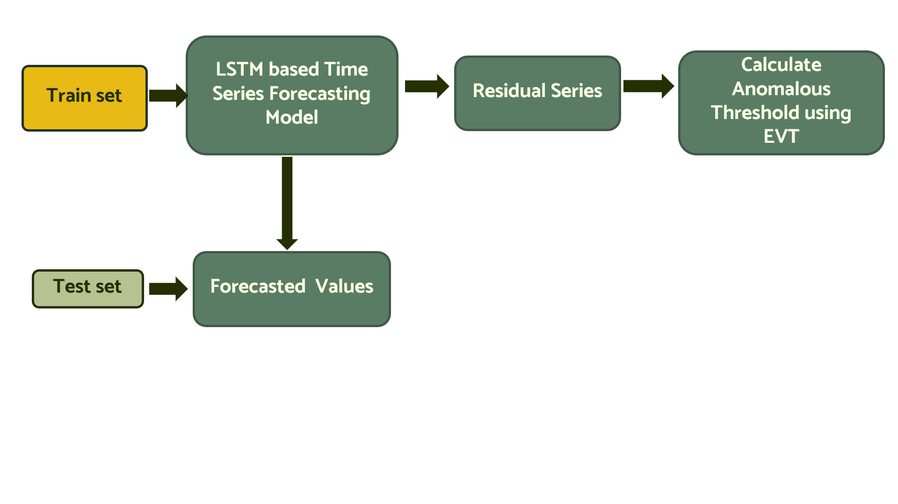
```

---


### On-line Phase
```{r   out.width = "100%", echo = FALSE, fig.cap='', fig.align='center'}
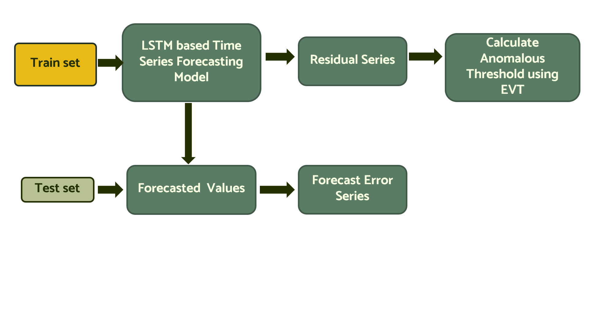
```

---


### On-line Phase
```{r   out.width = "100%", echo = FALSE, fig.cap='', fig.align='center'}
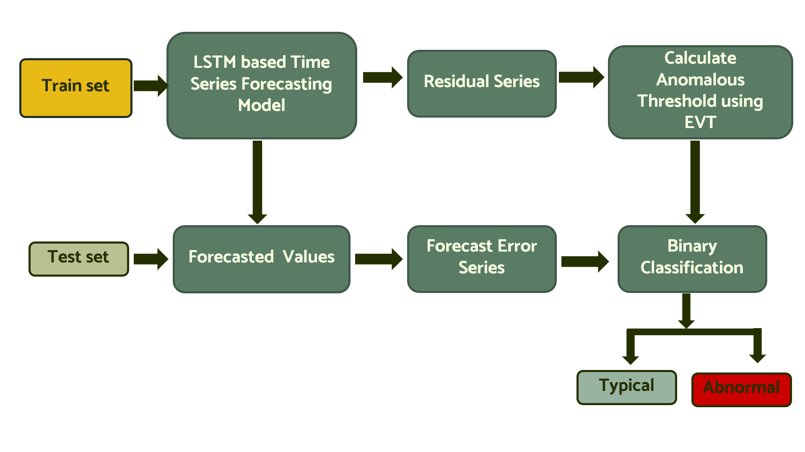
```

---
```{r   out.width = "100%", echo = FALSE, fig.cap='', fig.align='center'}
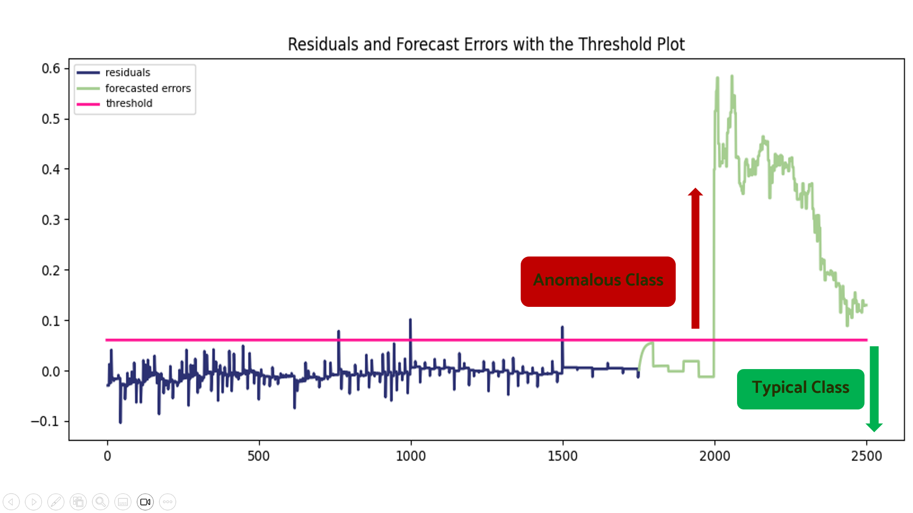
```
---
```{r   out.width = "100%", echo = FALSE, fig.cap='', fig.align='center'}
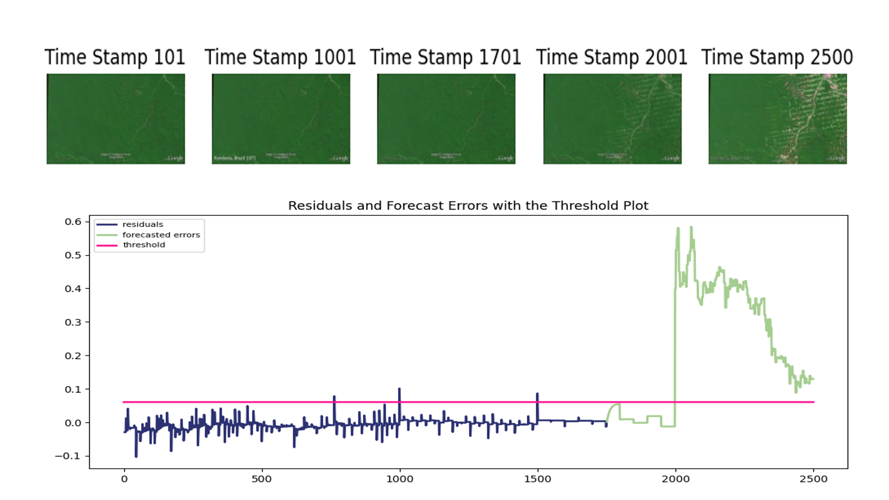
```
---
```{r   out.width = "100%", echo = FALSE, fig.cap='', fig.align='center'}
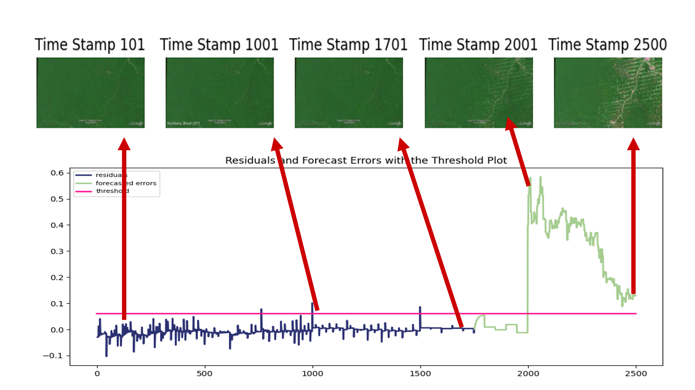
```

---

## Performance Evaluation

|             | Conventional  ML Framework | Xception |  VGG16 | DenseNet121 | ResNet50 | InceptionV3 |
|:-----------:|:----------------------:|:--------:|:------:|:-----------:|:--------:|:-----------:|
|   Accuracy  |          79.6%         |  70.09%  | 79.57% |    79.57%   |  92.92%  |    **99.60%**   |
| Sensitivity |           1.0          |   0.958  |   1.0  |     1.0     |    1.0   |     **1.0**     |
| Specificity |          0.388         |   0.188  |  0.388 |    0.388    |   0.788  |    **0.988**    |
|     PPV     |          0.77          |   0.702  |  0.765 |    0.765    |   0.904  |    **0.994**    |
|     NPV     |           1.0          |   0.691  |   1.0  |     1.0     |    1.0   |     **1.0**     |
|   F1-Score  |          0.87          |   0.810  |  0.867 |    0.867    |   0.950  |    **0.997**    |
|    G-Mean   |          0.62          |   0.424  |  0.623 |    0.623    |   0.888  |    **0.994**    |

---
#### Conventional  Machine Learning Framework
```{r   out.width = "95%", echo = FALSE, fig.cap='', fig.align='center'}
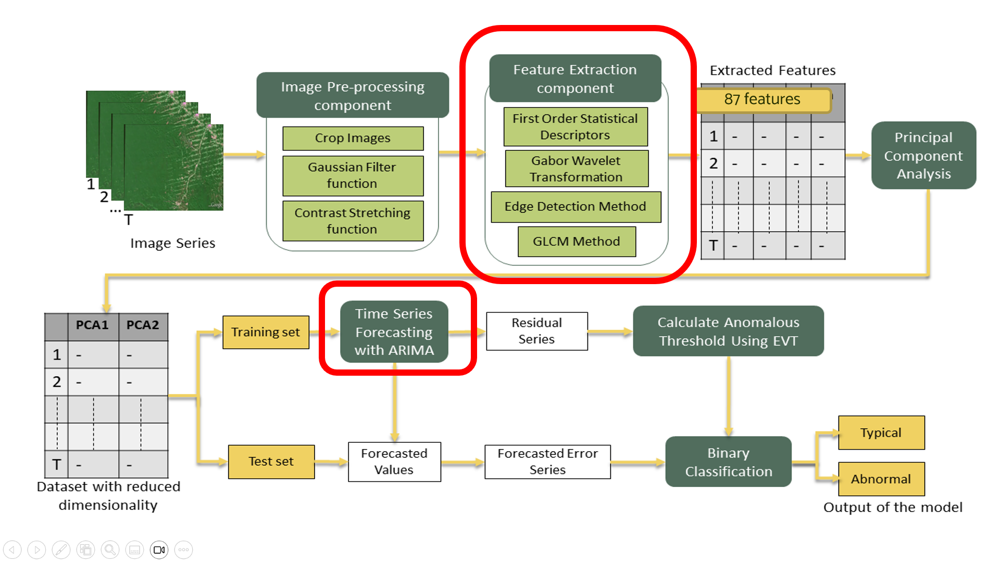
```

---
## Performance Evaluation

|             | Conventional  ML Framework | Xception |  VGG16 | DenseNet121 | ResNet50 | InceptionV3 |
|:-----------:|:----------------------:|:--------:|:------:|:-----------:|:--------:|:-----------:|
|   Accuracy  |          79.6%         |  70.09%  | 79.57% |    79.57%   |  92.92%  |    **99.60%**   |
| Sensitivity |           1.0          |   0.958  |   1.0  |     1.0     |    1.0   |     **1.0**     |
| Specificity |          0.388         |   0.188  |  0.388 |    0.388    |   0.788  |    **0.988**    |
|     PPV     |          0.77          |   0.702  |  0.765 |    0.765    |   0.904  |    **0.994**    |
|     NPV     |           1.0          |   0.691  |   1.0  |     1.0     |    1.0   |     **1.0**     |
|   F1-Score  |          0.87          |   0.810  |  0.867 |    0.867    |   0.950  |    **0.997**    |
|    G-Mean   |          0.62          |   0.424  |  0.623 |    0.623    |   0.888  |    **0.994**    |

---
class: inverse, middle, center

# XAI role in the framework
---
### XAI role in the framework


```{r   out.width = "70%", echo = FALSE, fig.cap='', fig.align='center'}
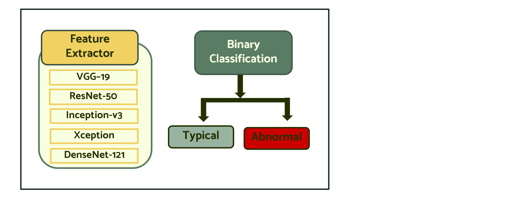
```

- Focus: Produce interpretations in local scope as post-hoc explanations for the black-box feature extraction models.
---
### XAI role in the framework

```{r   out.width = "70%", echo = FALSE, fig.cap='', fig.align='center'}
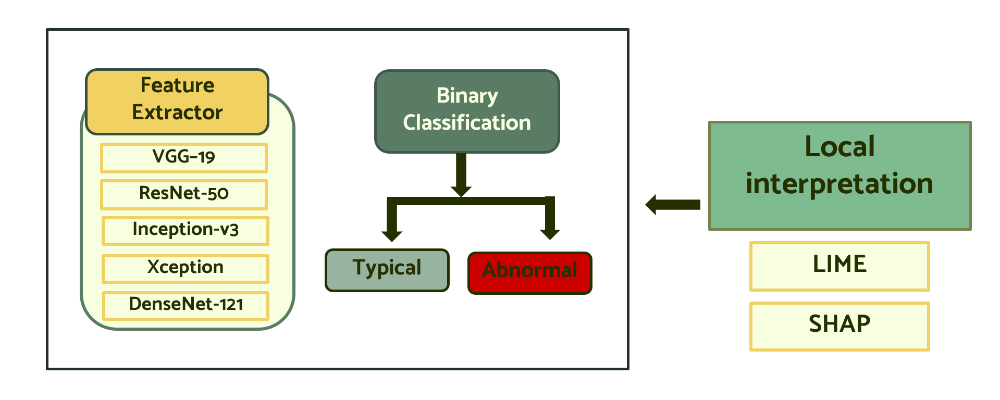
```

- Freeze the feature layer 

- Add a classification layer, on top of the frozen feature layer, and train the model on the new labeled data set


---
## Explainable AI Module - LIME

```{r   out.width = "90%", echo = FALSE, fig.cap='', fig.align='center'}
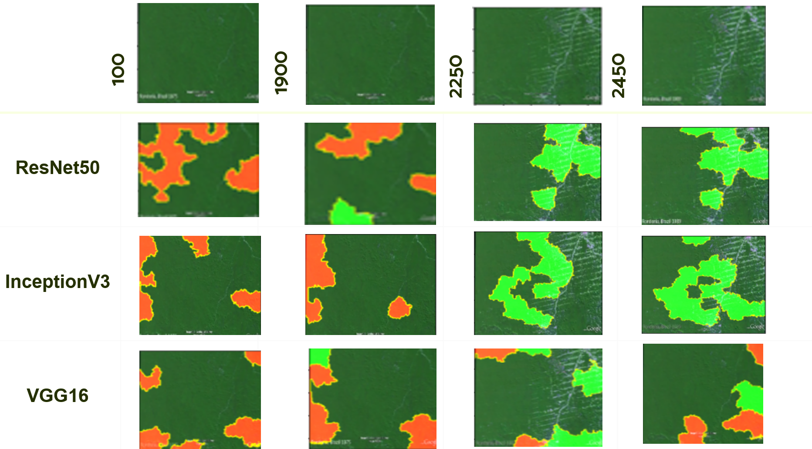
```

---

## Explainable AI Module - SHAP


```{r   out.width = "90%", echo = FALSE, fig.cap='', fig.align='center'}
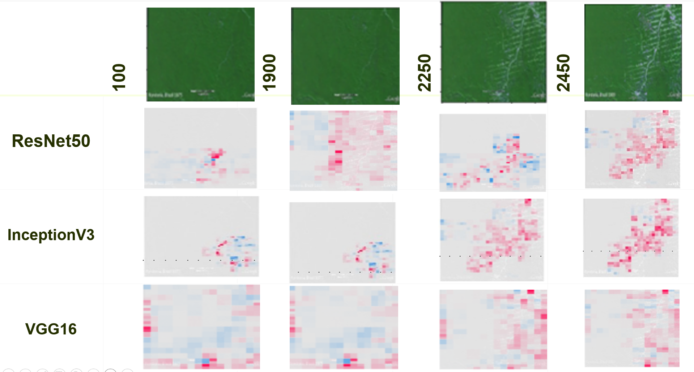
```

---

.pull-left[

## Research Gap   

- Binary classification problem (Low Generalizability) 

- Ignore the inter-dependency between the images

- Manual  anomalous thresholds and unrealistic assumptions

- focus on the classification task, lack of explainability 

- Class imbalance problem

].pull-right[

## Main Contribution

-  One class classification problem  (High Generalizability)

- Integrated computer vision and time series forecasting 

- A data driven anomalous threshold using EVT theory

- Novel framework that integrated computer vision, time series
forecasting and explainable AI

- One class classification problem 
]

---

## What Next?

- Focus: To interpret the influence of different features on the final output layer's predictions

--

- Assume that the impact of the newly added hidden layers is negligible for interpretability, as transfer learning-based feature extractors are already expected to capture relevant information
--

- The internal structure of a model, including its hidden layers, plays a significant role in determining the model's behavior and predictions

--

- Sensitivity analysis - To identify how different configurations of the hidden layer affect the model's predictions

--

- From  perturbation-based techniques to  **backpropagation based XAI technique** such as Layer-wise Relevance Propagation (LRP)  to understand the internal representations and computations within the network

---
class: center, middle, inverse

# Thank you

```{r }
#icon::fontawesome("rocket", style = "solid")
icon::fa("envelope")
``` 
priyangad@uom.lk


```{r}
icon::fa("github")
icon::fa("twitter")

```
pridiltal

```{r}

icon::fa("globe")
```
https://prital.netlify.app/ </br>
(Slides available)


This work was supported in part by RETINA research lab funded by the OWSD, a program unit of United Nations Educational, Scientific and Cultural Organization (UNESCO).

---

---

## Challenges of Traditional Machine Learning Module

- Extraction of meaningful features is challenging.

- Curse of Dimensionality and class imbalance.

- Compromised computational performance during feature extraction.

- Dynamic nature of the anomalous class

---

#### Image Pre-processing

- Crop Images:

   - To clear out distractions such as the image series description that was present at the bottom of the image dataset.

- Normalize Images:


   - To ensure that each pixel has a similar data distribution to convergence faster while training the network.


- Contrast Stretching function:

   - Different CNN based feature extractions architectures are trained on pre-specified resolutions. 

   - To achieve optimal performance and to reduce heavy computation while increasing the processing speed, resized to fit the CNN architecture’s input requirement
---

#### Traditional Machine Learning Module - Feature Extraction


- First Order Statistical Descriptors:
   - To extract texture features present in the image and are calculated by inputting each pixel of the image sequentially.
   - Features: Mean, Average Contrast, Skewness, and Kurtosis.

- Gabor Wavelet Transformation:

   - To extract Gabor Wavelet features from the image series, and it uses bandpass filters which are called Gabor filters.

- Edge Detection Method:
   
   - Detect the edges in the images.
   - Canny Edge Detector, Edge Roberts detector, Edge Sobel detector, Edge Scharr detector, and the Edge Prewitt detector.
---

#### Traditional Machine Learning Module - Feature Extraction
- GLCM (Gray Level Coocurrence Matrix) Method:

  - Extraction of texture-based second order statistical features from an image.
  - Considers the relationships among three or more pixels. 
  - Features: Dissimilarity, Correlation, Homogeneity, Energy, Contrast and Entropy.

---

## Dimension Reduction:

- Added a Global Max Pooling 2D layer => single feature vector for each image in the dataset.

Get the average of feature vector for each image => forms a univariate feature series.

---

### Backpropagation-Based Techniques:

- Backpropagation-based techniques, such as Layer-wise Relevance Propagation (LRP) mentioned earlier, **focus on understanding the importance of individual neurons or features within the neural network**

- Backpropagation-based techniques provide a more detailed and fine-grained understanding of the model's decision process, as they consider the internal representations and computations within the network
